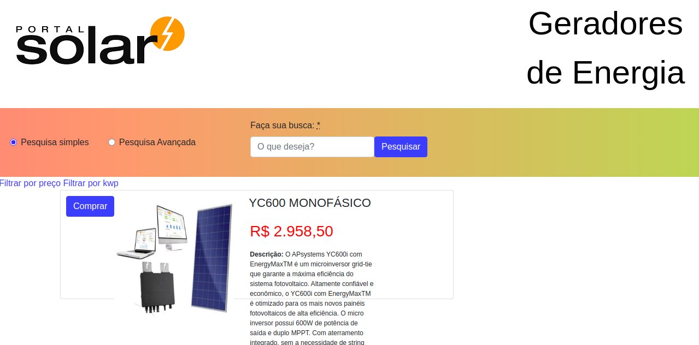

 

# Portal Solar - Dev Test

Primeiramente, você pode encontrar os requerimentos deste projeto [aqui](https://github.com/portalsolar/portal-solar-dev-test)

As cores do design e o layout foram criados pelo [Portal Solar](https://www.portalsolar.com.br/).

Neste projeto, eu:

- Implementei novas funcionalidades ao sistema de busca, recomendação e melhor custo de frete para geradores de energia;
- Implementei uma funcionalidade de recomendação geradores de energia para o usuário utilizando os campos que existem no modelo do PowerGenerator. Em outras palavras, o usuário poderá informar alguns dados que possam ser utilizados para recomendar estes geradores de energia;
- Implementei função para consultar o custo do frete (modelo Freight) baseado no CEP informado. Ao clicar em 'Comprar', uma nova tela é aberta. Utilizei [esta](https://apicep.com/api-de-consulta/) API pública para descobrir cidade e estado através do CEP;
- Implementei um filtro simples, que ordena por preço na tela inicial, trazendo os resultados ordenados por nome;
- Apliquei um segundo filtro baseado no anterior, ordenando por KWP;
- Fiz deploy no Netlify.

## Desenvolvido com

Ruby on Rails, HTML, Bootstrap e CSS.

## App Online

[Clique aqui para ver online](https://murilo-dev-test.herokuapp.com/)

## Começando

- Clone o projeto para sua máquina local;
- `cd` no diretório do projeto;
- Rode `bundle install` para instalar as gems necessárias;
- Rode `rails db:create`;
- Rode `rails db:migrate`;
- Rode `rails s` para iniciar o servidor no seu computador;
- No endereço do seu navegador, digite o seguinte: [localhost:3000](localhost:3000);
- Aproveite o aplicativo e suas funcionalidades!

## Autor

Murilo Roque Paiva da Silva

Github: [@MuriloRoque](https://github.com/MuriloRoque)

Twitter: [@MuriloRoquePai1](https://twitter.com/MuriloRoquePai1)

Linkedin: [MuriloRoque](https://www.linkedin.com/in/murilo-roque-b1268741/)

## 🤝 Contribuindo

Contribuições, problemas e pedidos são bem vindos! Comece por:

- Forke o projeto;
- Clone o projeto para sua máquina local;
- `cd` no diretório do projeto;
- Rode `git checkout -b your-branch-name`
- Faça suas contribuições;
- Push sua branch para o repo forkado;
- Abra uma Pull Request com a descrição detalhada para a branch de desenvolvimento do projeto original para uma revisão.

## Mostre seu suporte

Me dê uma ⭐️ se você gostou deste projeto!
